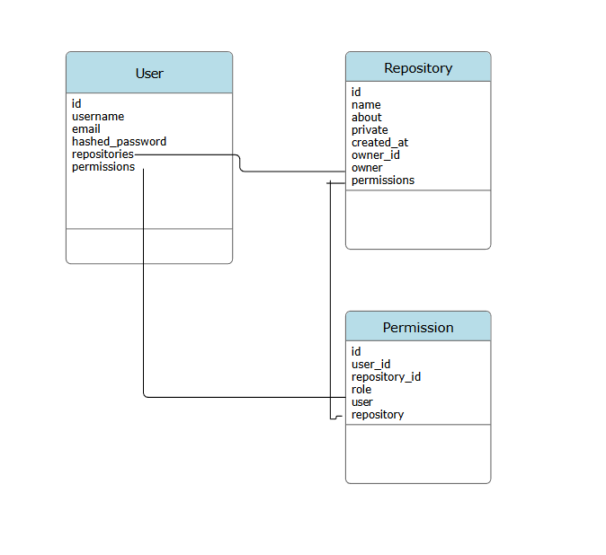
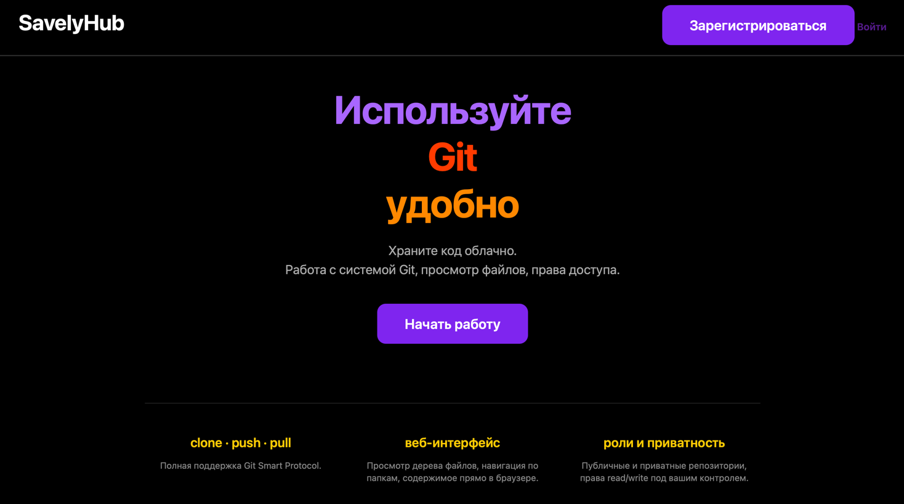
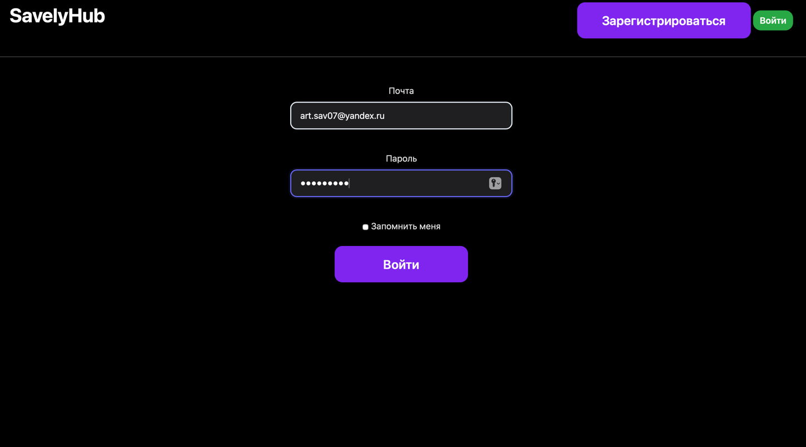

# SavelyHub
Самостоятельный Git-хостинг на Flask — ваш личный GitHub с авторизацией и веб-интерфейсом.

## Возможности
* Регистрация/авторизация пользователей
* Создание репозиториев и работа с ними
* Git c HTTP (clone/push/pull)
* Веб-интерфейс для просмотра репозиториев

## ТЗ
* продумать архитектуру проекта
* продумать структуру базы данных и определить модели
* реализовать слой repository для работы с бд
* реализовать слой services для бизнес логики приложения
* настроить работу git http для создания и клонирования репозиториев
* реализовать создание flask приложения и его настройку
* реализовать роуты, шаблоны и формы для регистрации и входа в приложение
* реализовать создание новых репозиториев и их клонирование
* написать роут домашней страницы пользователя с его репозиториями
* написать роут страницы репозитория с отображением его дерева
* сделать оформление страниц сайта посредством стилей

## Схема базы данных

## Пояснительная записка
**Автор проекта:** Савельев Артём
**Название проекта:** SavelyHub
### **Описание**
Сайт является git-хостингом для работы с удаленными репозиториями с системой git. 
Приложение позволяет создавать репозитории, скачивать проекты, отправлять пуши на сервер, клонировать репозитории.
Реализована регистрация и авторизация пользователя, можно настраивать права доступа - сделать репозитроий приватным или публичным.
### Реализция
Работать с системой гит позволяет реализованный класс GitService.
Именно он содержит методы которые позволяют прочитать репозиторий. А роуты в git/endpoints.py файле позволяют с помощью команд создавать bare репозитории, клонировать их, отправлять пуши на сервер.
Библиотека GitPython позволяет читать данные репозитория для его отображения на странице: получение дерева проекта, содержимого файлов.
Все репозитории хранятся на сервере в директории repos.
### Библиотеки нужные для работы
alembic==1.18.4
anyio==4.13.0
blinker==1.9.0
click==8.3.3
Flask==3.1.3
Flask-Login==0.6.3
Flask-Migrate==4.1.0
Flask-SQLAlchemy==3.1.1
Flask-WTF==1.3.0
gitdb==4.0.12
GitPython==3.1.49
idna==3.13
itsdangerous==2.2.0
Jinja2==3.1.6
Mako==1.3.12
MarkupSafe==3.0.3
pfluent==0.0.1
smmap==5.0.3
SQLAlchemy==2.0.49
starlette==1.0.0
typing_extensions==4.15.0
Werkzeug==3.1.8
WTForms==3.2.1

### Скриншоты

### Презентация

https://disk.yandex.ru/d/DOkgaKJkyDkOog